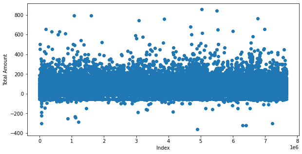

# Data Science Project: New York Taxi income Prediction

## Problem Definition
This project revolves around **predicting the average income of a taxi driver** in New York City per region and per hour. The task is a form of **supervised learning** as it utilizes labeled training data (the known incomes of taxi drivers) to train machine learning models. It falls under the **regression category** since the aim is **to predict a continuous variable - the average income of a taxi driver**.

## Motivation of the Project
This project is inspired by practical considerations. Imagine a taxi drivers' union that wants to guarantee fair opportunities for all its members and make sure that taxis are available all over the city. Without a systematic way to allocate drivers, they might all flock to the busiest parts of town, leaving other areas without enough taxis.

One way to solve this could be assigning drivers randomly to different areas. However, this might unintentionally result in some drivers always being sent to busy, profitable areas, while others continually end up in quieter parts of town, earning less.

This project can help solve this problem. By identifying the areas of the city that potentially generate higher income, we can optimally assign drivers at different times of the day. This ensures a more balanced distribution of income among drivers and guarantees that taxis are available in all areas of the city.

## Tools

The project was implemented using Python and a number of its data science and machine learning libraries, including NumPy, pandas for data handling, Matplotlib, and seaborn for data visualization, scikit-learn for model building and evaluation, and others for various stages of the project.

## Dataset
The dataset used in this project is publicly available on the **TLC website and contains more than 1.1 billion taxi trips taken in New York City between 2009 and 2019**. The data for this project was obtained from the [TLC Trip Record Data](https://www1.nyc.gov/site/tlc/about/tlc-trip-record-data.page)

The dataset includes information on trip distance, pickup and drop-off locations, fare amount, and other trip details.The detailed explanation about each column present in the dataset can be found in the [data dictionary](https://www1.nyc.gov/assets/tlc/downloads/pdf/data_dictionary_trip_records_yellow.pdf).

We have filtered the dataset to include only the trips taken by yellow taxis in **January 2019**, which resulted in a dataset with **more than 8 million records**.

## Data Cleaning

 
**Negative total amount values**: The minimum total fare recorded is -$362.80, which doesn't make sense in practical terms because a fare shouldn't be negative. This could be due to data entry errors or some kind of adjustment or refund. Other negative values appeared on the plot, therefore we removed the negative total amount values. We also removed the Zero values.

