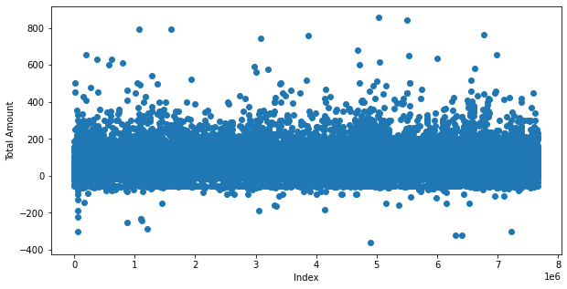
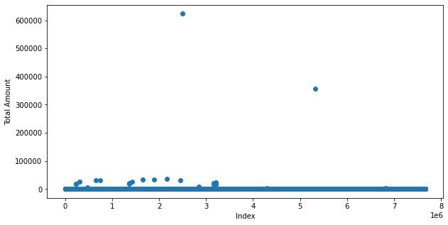
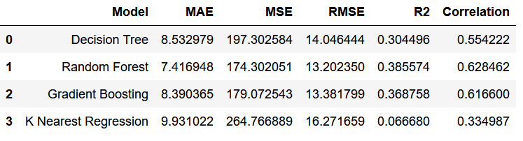
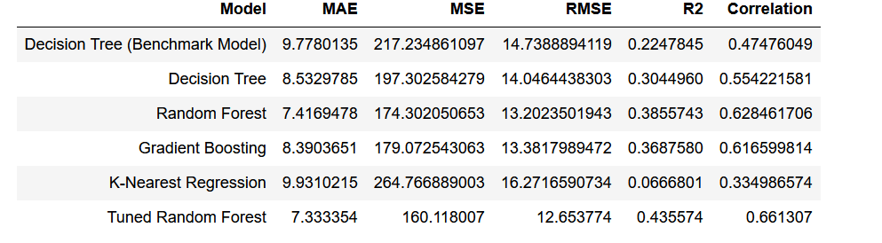

# Data Science Project: New York Taxi income Prediction

## Problem Definition
This project revolves around **predicting the average income of a taxi driver** in New York City per region and per hour. The task is a form of **supervised learning** as it utilizes labeled training data (the known incomes of taxi drivers) to train machine learning models. It falls under the **regression category** since the aim is **to predict a continuous variable - the average income of a taxi driver**.

## Motivation of the Project
This project is inspired by practical considerations. Imagine a taxi drivers' union that wants to guarantee fair opportunities for all its members and make sure that taxis are available all over the city. Without a systematic way to allocate drivers, they might all flock to the busiest parts of town, leaving other areas without enough taxis.

One way to solve this could be assigning drivers randomly to different areas. However, this might unintentionally result in some drivers always being sent to busy, profitable areas, while others continually end up in quieter parts of town, earning less.

This project can help solve this problem. By identifying the areas of the city that potentially generate higher income, we can optimally assign drivers at different times of the day. This ensures a more balanced distribution of income among drivers and guarantees that taxis are available in all areas of the city.

## Tools

The project was implemented using **Python** and a number of its data science and machine learning libraries, including **NumPy, pandas for data handling**, **Matplotlib, and seaborn for data visualization**, **scikit-learn for model building and evaluation**, and others for various stages of the project.

## Dataset
The dataset used in this project is publicly available on the **TLC website and contains more than 1.1 billion taxi trips taken in New York City between 2009 and 2019**. The data for this project was obtained from the [TLC Trip Record Data](https://www1.nyc.gov/site/tlc/about/tlc-trip-record-data.page)

The dataset includes information on trip distance, pickup and drop-off locations, fare amount, and other trip details.The detailed explanation about each column present in the dataset can be found in the [data dictionary](https://www1.nyc.gov/assets/tlc/downloads/pdf/data_dictionary_trip_records_yellow.pdf).

We have filtered the dataset to include only the trips taken by yellow taxis in **January 2019**, which resulted in a dataset with **more than 7 million records**.

## Data Cleaning

 

 
**Negative total amount values**: The minimum total fare recorded is -$362.80, which doesn't make sense in practical terms because a fare shouldn't be negative. This could be due to data entry errors or some kind of adjustment or refund. Other negative values appeared on the plot, therefore we removed the negative total amount values. We also removed the Zero values.

 

**Too-high values for total_amount**: There were some total fare values that seemed way too high, even going up to $600,000, which just doesn't seem realistic for a taxi fare. To make the data more reliable, I decided to set an upper limit. The average taxi fare was around $16, and only 1166 fares were over $200. Considering the total data points of 7,667,792, losing those few didn't seem like a big sacrifice. So, I decided to remove any fare values above $200.

## Features of the Model

Here's a list of the original features available in the dataset that could be utilized for building the predictive model:

1. **PULocationID**: This is the ID assigned to the region where the trip started.
2. **transaction_date**: The date when the taxi ride took place.
3. **transaction_month**: The month of the year when the taxi ride took place.
4. **transaction_day**: The day of the month when the taxi ride occurred.
5. **transaction_hour**: The hour of the day when the taxi ride started.
6. **trip_distance**: The total distance covered during the taxi ride.
7. **total_amount**: The total amount charged for the taxi ride.
8. **count_of_transactions**: The number of transactions completed in a given time period. 

These features can provide important insights into taxi operations and income generation, forming the basis for our model's predictions.

## Feature Engineering

Feature engineering was an important part of the project. I introduced three new categories of features to enhance our model. 

1. The first category pertains to **time-related features**. This includes a binary value (true/false) indicating whether a particular day is a weekend or a holiday. 

2. The second category consists of **location-based data**. While our original data has Location IDs for different regions, I incorporated an additional layer of abstraction known as **Boroughs**. This more generalized location information was also sourced from our original dataset.

3. The final category of new features is related to **weather**. I obtained this information from a separate source which offers it free for development purposes.

With these new additions, the final model utilised the following features: 

- **PULocationID**
- **transaction_month**
- **transaction_day**
- **transaction_hour**
- **transaction_week_day**
- **weekend**
- **is_holiday**
- **Borough**
- **temperature**
- **humidity**
- **wind speed**
- **cloud cover**
- **amount of precipitation**
- **total_amount**

These new features not only provided additional insights but also contributed to refining the predictive accuracy of our model.

When we first used **trip_distance** in our model, it really helped to make our predictions more accurate. But we decided to not include it later on, and there's a good reason for that.

Think about when you're about to take a taxi ride. Most of the time, you wouldn't know exactly how far you're going to travel. Because of this, a model that heavily depends on **trip_distance** to predict the cost might not be very helpful in real life.

So, even though **trip_distance** seemed to be a great feature statistically, it might not be that useful practically. We wanted our model to be really helpful in real situations. That's why we decided not to use **trip_distance** and focused more on other features that people usually know before their ride, like where they are, what time it is, and what day of the week it is.

## Models and Results

Several machine learning algorithms were tested in the project, including **Decision Trees, Random Forests, Gradient Boosting**, and **K-Nearest Regression**. Each model's performance was evaluated using metrics such as **mean absolute error (MAE)**, **mean squared error (MSE)**, **root mean squared error (RMSE)**, **R-squared**, and the **correlation between the true and predicted values**.

**Lower values for MAE, MSE, and RMSE, along with higher values for R2 and correlation, indicate better model performance.**

In the course of this project, I tested four different types of algorithms: **Decision Trees**, **Random Forest**, **Gradient Boosting** and **K-Nearest Regression**. Each of these algorithms approaches the problem in a slightly different way, which can lead to different results. 

The first model I built, also known as the **Benchmark model, used a Decision Tree algorithm**. In this initial model, I only included the **original features provided in the dataset, as listed earlier**. After setting this benchmark, I then implemented  **Decision Tree** again and  3 other models such as **Random Forest, Gradient Boosting and KNN- Regression**, but they all were enhanced! For these, I included not just the original data features, but also **additional features (using Feature Engineering)**  that I created myself to provide more insights. By comparing the results from the benchmark model to these enhanced models, I could see how much these extra features improved my predictions. Results are shown below:

 

We tested several models to predict taxi demand. **The Random Forest model, which used all original and new features, performed the best. It made the smallest errors, explained the most variability, and had the strongest correlation between predicted and actual values**. **The K-Nearest Regression model** performed the worst on all metrics. The other models, including **Decision Tree** and **Gradient Boosting**, performed better than our initial benchmark model but not as well as the **Random Forest model**.

The **Random Forest model** is selected to be **tuned**. Here are the best parameter values:

 N_estimators at 1800,  min_samples_split: at 2,  min_samples_leaf at  4,  max_features set to sqrt,  max_depth at  300 and  bootstrap set to True

I've decided to choose the parameter values that resulted in the **third-best performance**, as they were quite close to the best performance but **required fewer estimators, making the model more efficient**. These parameters are: 

n_estimators at 200, min_samples_split at 10, min_samples_leaf at 2, max_features set to 'sqrt', max_depth at 150, and bootstrap set to True. 

Although the model with the highest number of estimators (n_estimators) performed slightly better, the increase in computational complexity wasn't worth the relatively minor improvement in performance.

The final results are shown below:

 

1. **Decision Tree (Benchmark Model)**: This was our baseline model, built using a decision tree algorithm and only the original features. It had the second highest errors across MAE, MSE, and RMSE, and the lowest R2 and correlation values, showing room for improvement.

2. **Decision Tree**: By adding new features into this decision tree model, we reduced the errors across all three metrics compared to the benchmark model and increased the R2 and correlation, showing that the model is better at predicting taxi trip duration.

3. **Random Forest**: This model significantly reduced errors and increased the R2 and correlation values compared to both decision tree models, making it a much better model for prediction.

4. **Gradient Boosting**: While this model performed better than both decision tree models, it didn't outperform the random forest model. However, it still has a good balance between error reduction and model complexity.

5. **K-Nearest Regression**: This model didn't perform as well as we hoped. It had the highest errors and lowest R2 and correlation values, making it the least accurate model for our data.

6. **Tuned Random Forest**: The best performing model was the tuned random forest model, with the lowest errors and highest R2 and correlation values. This indicates that this model is the most accurate at predicting taxi trip duration from the data provided.

   Here is the correlation between True and Predicted value plot for the tuned random forest model. X-axis is the true values and y-axis the predicted values.

    

## What's Next? (Future Work)

There is always room for improvement in any data science project. For future work, we might look at adding more information to our dataset, possibly using data from other sources. We could also try out different types of models or play around with the settings of our current models to see if we can improve their performance. One exciting idea could be to put our model into a web app or something similar, so it's easier for others to use.

Just a reminder - all our work so far is based on data for yellow taxi rides from **January 2009**. So, another thing we could do is to use data from different months or years. That way, our model could learn from more varied data and hopefully do a better job at predicting taxi fares.

